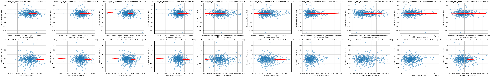

## About Me

Hello, 

My name is Ryan Thomas and I am a graduate of Lehigh University. I majored in finance with a minor in computer science. Thorugout my time at Lehigh I gained unique skills within these two fields of study and have a profound desire to enhance these skills thorughout my career. When I am not spending my time working I like to enjoy the outdoors by fishing and running. Additionally, I like to weightlift and play baseball. 

<!-- Upload your own photo and change the path -->

<!-- 

  

 -->

---

## Financial Data Analytics Projects

<!-- You can link to other websites, PDFs in this repo, and other pages in this repo -->

_**[Natural language processing 10-Ks to identify positive or negative sentiment](midterm_summary)**_

## Summary of Findings:

### LM vs. ML Sentiment Comparison:
- Both LM and ML sentiment variables around the first return show a weak linear relationship.
- Positive sentiment values for both LM and ML exhibit denser clusters, indicating a stronger relationship with returns.
- Negative sentiment values are more dispersed, suggesting either a weaker impact on returns or a weaker relationship compared to positive sentiment.

### Comparison with Table 3:
- R-Squared values for positive and negative LM sentiments are slightly higher than those in Table 3 from Garcia, Hu, and Roher's paper.
- Possible reasons for differences include variations in data relationships and missing data, leading to potential underfitting of models.

### Contextual Sentiment Analysis:
- Positive Regulatory Sentiment shows a strong relationship with returns, with few outliers and a dense cluster.
- Negative Financial Performance also exhibits a strong relationship, with few outliers and a denser cluster suggesting influence on returns.

### Sign and Magnitude Differences:
- Differences in signs and magnitudes are evident, such as a large negative value with low magnitude in the Negative Financial plot, indicating potential disproportionate influence on return-sentiment relationship.

---

_**[Regression Practice](Regression_practice)**_

Or: The process that created this page can be used to show off your whole midterm analysis file, as is.

---

_**[Eventual team project](https://donbowen.github.io/teamproject/)**_

---

_**[Some personal project](/pdf/sample_presentation.pdf)**_

---

## Career Objectives

Write what you want. 

Sell yourself!

---

## Hobbies

Maybe include a little about these, especially if they are the kinds of things that work well in interviews.

---

Page template forked from <a href="https://github.com/evanca/quick-portfolio">evanca</a>

<!-- Remove above link if you don't want to attibute -->
